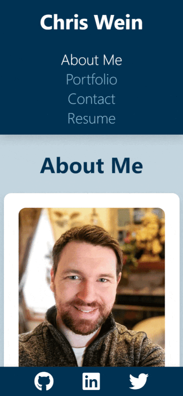

# Personal Portfolio - Built Using React

## Description of the Website
This website is a personal portfolio meant to show off my previous work, give information about myself, and provide a downloadable resume. Just use the navigation bar at the top of the page to view each section.

 

## Website Features
* Website is a single-page application designed using React.
* Mobile Responsiveness
    * Each screen size has been tested to verify that the app is friendy and easy to use with all devices.
* Contact form has built-in validation to ensure all fields are completed and email address is in good form.
    * Note: Back-end functionality has not yet been implimented.

  
 

## Link to Portfolio
https://chriswein12.github.io/react-portfolio/

 

## How the Website Looks on a Desktop Display

 

## How the Website Looks on a Mobile Display

 

## Credits

*Project completed by Chris Wein*